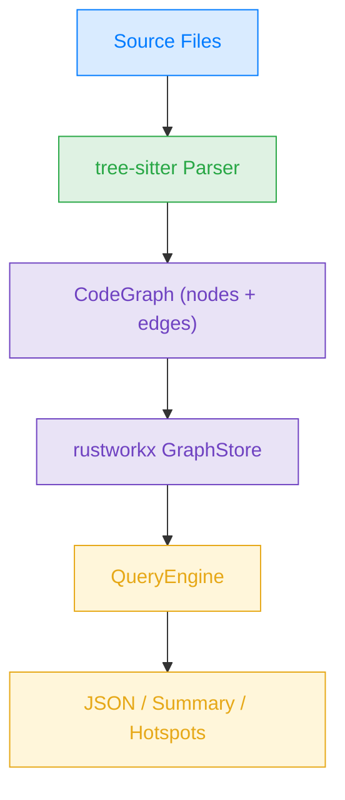
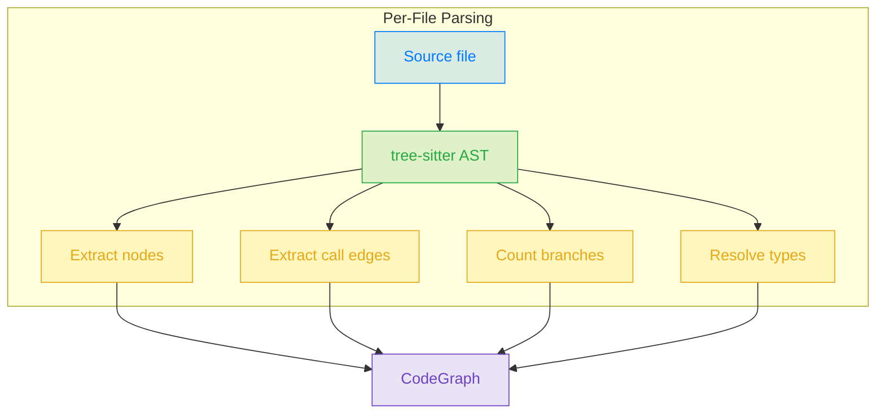
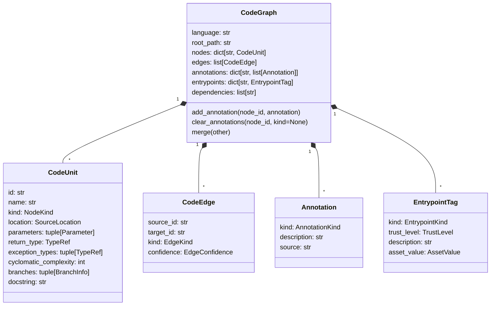
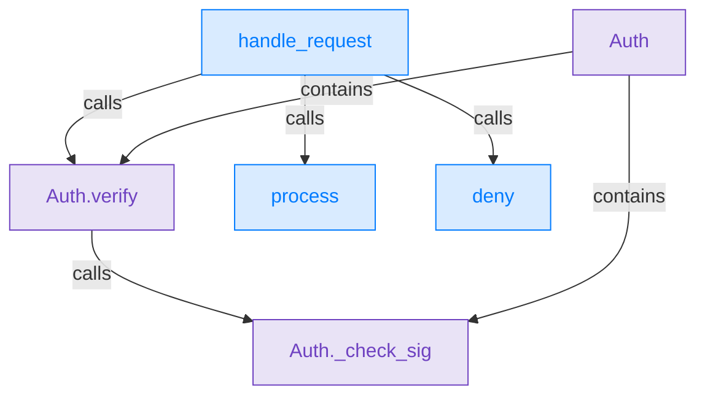

# Trailmark

[](https://github.com/trailofbits/trailmark/actions/workflows/ci.yml)
[](https://github.com/trailofbits/trailmark/actions/workflows/mutation.yml)

Parse source code into queryable graphs of functions, classes, calls, and semantic annotations for security analysis.

Trailmark uses [tree-sitter](https://tree-sitter.github.io/) for language-agnostic AST parsing and [rustworkx](https://www.rustworkx.org/) for high-performance graph traversal. The long-term vision is to combine this graph with mutation testing and coverage-guided fuzzing to identify gaps between assumptions and test coverage that are reachable from user input.

## How It Works

Trailmark operates in three phases: **parse**, **index**, and **query**.



### 1. Parse

A language-specific parser walks the directory, parses each file into a tree-sitter AST, and extracts:

- **Nodes** &mdash; functions, methods, classes, structs, interfaces, traits, enums, modules, namespaces
- **Edges** &mdash; calls, inheritance, implementation, containment, imports
- **Metadata** &mdash; type annotations, cyclomatic complexity, branches, docstrings, exception types

### Supported Languages

| Language | Extensions | Key constructs |
| --- | --- | --- |
| Python | `.py` | functions, classes, methods |
| JavaScript | `.js`, `.jsx`, `.mjs`, `.cjs` | functions, classes, arrow functions |
| TypeScript | `.ts`, `.tsx` | functions, classes, interfaces, enums |
| PHP | `.php` | functions, classes, interfaces, traits |
| Ruby | `.rb` | methods, classes, modules |
| C | `.c`, `.h` | functions, structs, enums |
| C++ | `.cpp`, `.hpp`, `.cc`, `.hh`, `.cxx`, `.hxx` | functions, classes, structs, namespaces |
| C# | `.cs` | methods, classes, interfaces, structs, enums, namespaces |
| Java | `.java` | methods, classes, interfaces, enums |
| Go | `.go` | functions, methods, structs, interfaces |
| Rust | `.rs` | functions, structs, traits, enums, impl blocks |
| Solidity | `.sol` | contracts, interfaces, libraries, functions, modifiers, structs, enums |
| Cairo | `.cairo` | functions, traits, structs, enums, impl blocks, StarkNet contracts |
| Circom | `.circom` | templates, functions, signals, components |
| Haskell | `.hs` | functions, data types, type classes, instances |
| Erlang | `.erl` | functions, records, behaviours, modules |
| Miden Assembly | `.masm` | procedures, entrypoints, constants, invocations |
| Swift | `.swift` | functions, classes, structs, enums, protocols, extensions |
| Objective-C | `.m`, `.mm`, `.h` | C functions, classes, methods (selector-based naming) |
| Kotlin | `.kt`, `.kts` | functions, classes, interfaces, data classes, objects, methods |
| Dart | `.dart` | functions, classes, abstract classes, methods, constructors |



Node IDs follow the scheme `module:function`, `module:Class`, or `module:Class.method` for unambiguous lookup. Directory parsing resolves bare cross-file calls when a unique definition exists; ambiguous cross-file calls are left at their original best-effort target and marked `uncertain`. Edge confidence is tagged as `certain` (direct calls, `self.method()`), `inferred` (attribute access on non-self objects), or `uncertain` (dynamic dispatch or ambiguous resolution).

### 2. Index

The `GraphStore` loads the `CodeGraph` into a rustworkx `PyDiGraph` and builds bidirectional ID/index mappings for fast traversal.

### 3. Query

The `QueryEngine` provides a high-level API over the indexed graph:

| Method | Description |
| --- | --- |
| `callers_of(name)` | Direct callers of the named target |
| `callees_of(name)` | Direct callees of the named source |
| `ancestors_of(name)` | Every function that can transitively reach the target (upward slice) |
| `reachable_from(name)` | Every function transitively reachable from the source |
| `paths_between(src, dst)` | All simple call paths between two nodes |
| `entrypoint_paths_to(name)` | Paths from any detected entrypoint to the target |
| `attack_surface()` | Entrypoints tagged with trust level and asset value |
| `complexity_hotspots(n)` | Functions with cyclomatic complexity &ge; n |
| `functions_that_raise(exc)` | Functions whose parser-detected exception list includes `exc` |
| `annotate(name, kind, description, source)` | Add a semantic annotation to a node |
| `annotations_of(name, kind=None)` | Get annotations for a node, optionally filtered by kind |
| `nodes_with_annotation(kind)` | Every node tagged with the given annotation kind |
| `clear_annotations(name, kind=None)` | Remove annotations from a node |
| `diff_against(other)` | Structural diff of this engine's graph vs. another |
| `preanalysis()` | Run the built-in pre-analysis passes and store annotations/subgraphs |
| `augment_sarif(path)` | Merge SARIF findings into the graph |
| `augment_weaudit(path)` | Merge weAudit findings into the graph |
| `findings(kind=None)` | Return nodes carrying finding-style annotations |
| `subgraph(name)` | Return the nodes in a named subgraph |
| `subgraph_names()` | List every named subgraph currently on the graph |
| `summary()` | Node counts, edge counts, dependencies |
| `to_json()` | Full graph export |

### Data Model



**Node kinds:** `function`, `method`, `class`, `module`, `struct`, `interface`, `trait`, `enum`, `namespace`, `contract`, `library`

**Edge kinds:** `calls`, `inherits`, `implements`, `contains`, `imports`

**Edge confidence:** `certain`, `inferred`, `uncertain`

### Example Graph

Given this Python code:

```python
class Auth:
    def verify(self, token: str) -> bool:
        return self._check_sig(token)

    def _check_sig(self, token: str) -> bool:
        ...

def handle_request(req: Request) -> Response:
    auth = Auth()
    if auth.verify(req.token):
        return process(req)
    return deny()
```

Trailmark produces a graph like:



## Installation

The examples below track the current development branch. For the latest
published package, install from PyPI. For the exact feature set described
here, install from a checkout and run commands via `uv run`.

```bash
# Latest published release
uv pip install trailmark

# Current checkout / development branch
uv sync --all-groups
```

Requires Python &ge; 3.12.

## Usage

```bash
# Report the installed version
trailmark --version     # or: trailmark -V
trailmark version       # subcommand form

# Full JSON graph (Python, the default)
trailmark analyze path/to/project

# Analyze a different language
trailmark analyze --language rust path/to/project
trailmark analyze --language javascript path/to/project

# Polyglot: auto-detect and merge every supported language found in the
# tree, or pass an explicit comma-separated list.
trailmark analyze --language auto path/to/project
trailmark analyze --language python,rust,solidity path/to/project

# Summary statistics
trailmark analyze --summary path/to/project

# Complexity hotspots (threshold >= 10)
trailmark analyze --complexity 10 path/to/project

# Augment the graph with external findings (SARIF from static analyzers,
# weAudit findings from the VS Code extension). Each --sarif / --weaudit
# flag is repeatable. Add --json to print the augmented graph.
trailmark augment --sarif results.sarif path/to/project
trailmark augment --weaudit findings.json path/to/project
trailmark augment --sarif a.sarif --sarif b.sarif --json path/to/project

# List detected entrypoints (attack surface). Uses heuristic detection
# (main() functions, pyproject.toml [project.scripts]) plus an optional
# override file at .trailmark/entrypoints.toml (see below).
trailmark entrypoints path/to/project
trailmark entrypoints --json path/to/project

# Structural diff between two code graphs. Accepts directory paths or
# git refs (branches, tags, commits). Surfaces added/removed nodes,
# call-edge changes, and — most usefully — attack-surface changes.
trailmark diff before/ after/
trailmark diff --repo . main HEAD          # compare git refs
trailmark diff --json before/ after/        # machine-readable output
```

### Entrypoint detection

Trailmark automatically populates `graph.entrypoints` so `attack_surface()`, taint propagation, and privilege-boundary crossing have data to work with. Detection runs in four layers, each overriding the last:

1. **Generic `main` heuristic.** Any function named `main` in any language. Tagged `user_input` / `trusted_internal` / `low`.
2. **Framework-aware scan.** Decorator, attribute, and visibility patterns per language — see the table below.
3. **`pyproject.toml [project.scripts]`.** Explicit CLI targets get an upgraded trust/asset classification.
4. **Repo-local override file.** Hand-curated entrypoints in `.trailmark/entrypoints.toml` always win.

Framework coverage:

| Language | Frameworks detected |
| --- | --- |
| Python | Flask, FastAPI, aiohttp, Click, Typer, Celery |
| JavaScript / TypeScript | NestJS, Next.js (App Router + Pages API), AWS Lambda |
| Java | Spring MVC / WebFlux, JAX-RS, Kafka listeners, servlets |
| C# | ASP.NET Core, Azure Functions |
| PHP | Symfony `#[Route]` attributes + legacy annotations |
| Rust | actix-web, rocket, FFI exports (`#[no_mangle]`, `pub extern "C"`), async-main attributes |
| Solidity | `external` / `public` visibility |
| Cairo / StarkNet | `#[external]`, `#[view]`, `#[l1_handler]`, `#[constructor]` |
| Circom | `component main` declarations |
| Miden Assembly | `export.<name>` directives |
| Haskell | top-level `main ::` / `main =` |
| Erlang | functions listed in `-export([...])` |
| Swift | `@main` app attribute |
| Objective-C | `UIApplicationDelegate` lifecycle selectors (e.g. `application:openURL:options:`) |
| Kotlin | Spring MVC / WebFlux annotations (shared with Java), Android component lifecycle methods (`onCreate`, `onReceive`, `onBind`, ...) |
| Dart | `@pragma('vm:entry-point')` native-callable markers |
| Go | `http.HandleFunc` / `http.Handle` stdlib registrations, gin/chi/echo-style `<router>.GET/POST/...` handler registrations |
| Ruby | Rails controller actions (classes inheriting `ApplicationController` / `ActionController::*`), Sidekiq worker `perform` methods |
| C / C++ | `extern "C"` linkage, `__attribute__((visibility("default")))`, `__declspec(dllexport)` |

For anything the heuristics miss, declare entrypoints explicitly in `.trailmark/entrypoints.toml` at the project root. The file supports both single-node and rule-based entries:

```toml
# Single-node entry
[[entrypoint]]
node = "my_module:handle_request"  # node id, or "module.path:function"
kind = "api"                       # user_input | api | database | file_system | third_party
trust = "untrusted_external"       # untrusted_external | semi_trusted_external | trusted_internal
asset_value = "high"               # high | medium | low
description = "HTTP POST /auth"

# Rule: every PHP script under public_html/ is a web-exposed entrypoint.
[[entrypoint]]
file_glob = "public_html/**/*.php"
kind = "user_input"
trust = "untrusted_external"
asset_value = "high"
description = "Web-exposed PHP script"

# Rule: any function that takes a PSR-7 request object.
[[entrypoint]]
param_type = "ServerRequestInterface"
kind = "api"
trust = "untrusted_external"
asset_value = "high"
description = "PSR-7 HTTP handler"

# Rule: functions named `handle_*`.
[[entrypoint]]
name_regex = "^handle_"
kind = "api"
trust = "untrusted_external"

# Rule: conditions compose with AND — web.py files AND name starts with handle_.
[[entrypoint]]
file_glob = "public/*.py"
name_regex = "^handle_"
kind = "api"
trust = "untrusted_external"
```

Later entries override earlier ones when two rules tag the same node, so place broad rules first and specific corrections after.

See [docs/entrypoint-patterns.md](docs/entrypoint-patterns.md) for the full reference, including frameworks not yet implemented (Express / Koa / Fastify, Laravel, Cobra, axum, warp, clap, and others) with grep-ready patterns contributors can use to add new detectors.

### Programmatic API

```python
from trailmark.parse import parse_directory, parse_file
from trailmark.query.api import QueryEngine

# Parse-only API: get the raw CodeGraph without building GraphStore/QueryEngine.
graph = parse_file("path/to/file.py")
graph = parse_directory("path/to/project", language="auto")

# Single-language (default) or auto-detect + merge across all languages
engine = QueryEngine.from_directory("path/to/project")
engine = QueryEngine.from_directory("path/to/project", language="auto")
engine = QueryEngine.from_directory("path/to/project", language="python,rust")

# Direct neighbors
engine.callers_of("handle_request")
engine.callees_of("handle_request")

# Transitive slicing — who could reach this sink, or what could it reach?
engine.ancestors_of("Auth._check_sig")
engine.reachable_from("handle_request")

# Attack-surface paths from any detected entrypoint
engine.entrypoint_paths_to("Auth._check_sig")

# All call paths between two nodes
engine.paths_between("handle_request", "Auth._check_sig")

# Functions with cyclomatic complexity >= 10
engine.complexity_hotspots(10)

# What functions can raise a given exception? (uses parser-detected
# exception_types; no runtime tracing required)
engine.functions_that_raise("PermissionError")

# Add and query semantic annotations
from trailmark.models.annotations import AnnotationKind

engine.annotate(
    "handle_request",
    AnnotationKind.ASSUMPTION,
    "Caller has already authenticated the session token",
    source="llm",
)
engine.annotations_of("handle_request")
engine.nodes_with_annotation(AnnotationKind.FINDING)

# Diff against an earlier snapshot of the same codebase
before = QueryEngine.from_directory("before/")
diff = engine.diff_against(before)
# diff contains: summary_delta, nodes {added/removed/modified},
# edges {added/removed}, entrypoints {added/removed/modified}

# Run the built-in audit-oriented preanalysis passes
engine.preanalysis()
engine.findings()
engine.subgraph_names()

# Programmatic augmentation hooks for external tooling
engine.augment_sarif("results.sarif")
engine.augment_weaudit("findings.json")
```

## Development

```bash
# Install package and dev dependencies
uv sync --all-groups

# Lint and format
uv run ruff check --fix
uv run ruff format

# Type check
uv tool install ty && ty check

# Tests
uv run pytest -q tests/

# Mutation testing (on macOS, set this env var to avoid rustworkx fork segfaults)
OBJC_DISABLE_INITIALIZE_FORK_SAFETY=YES uv run mutmut run
```

## License

Apache-2.0
